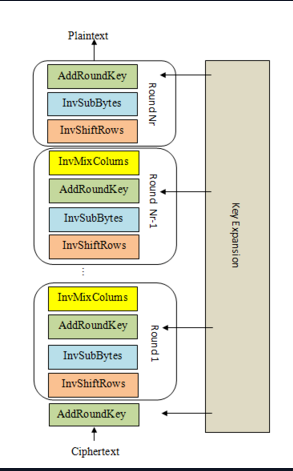

# CRYPTOHACK: SYMMETRIC CRYPTOGRAPHY SOLUTIONS

## BRINGING IT ALL TOGETHER

**TASK:** We've provided the key expansion code, and ciphertext that's been properly encrypted by AES-128. Copy in all the building blocks you've coded so far, and complete the decrypt function that implements the steps shown in the diagram. The decrypted plaintext is the flag.

Where the piece of code where we will work is:

```bash
def decrypt(key, ciphertext):
    round_keys = expand_key(key) # Remember to start from the last round key and work backwards through them when decrypting

    # Convert ciphertext to state matrix

    # Initial add round key step

    for i in range(N_ROUNDS - 1, 0, -1):
        pass # Do round

    # Run final round (skips the InvMixColumns step)

    # Convert state matrix to plaintext

    return plaintext
```

To solve this challenge, we must create a code that combines all the solutions from the previous challenges. Notice that the AES decryption process is as follows:



At the beginning of the code, notice how the key and the ciphertext are in a *binary string* format, thus we need to consider ways to manipulate this as recently we have only been working with matrices:

```bash
key        = b'\xc3,\\\xa6\xb5\x80^\x0c\xdb\x8d\xa5z*\xb6\xfe\\'
ciphertext = b'\xd1O\x14j\xa4+O\xb6\xa1\xc4\x08B)\x8f\x12\xdd'
```

Where the solution turned out to be:

```python
def decrypt(key, ciphertext):
    round_keys = expand_key(key) # Remember to start from the last round key and work backwards through them when decrypting

    # Convert ciphertext to state matrix
    state = bytes2matrix(ciphertext)

    # Initial add round key step
    addInitialKey(state, round_keys[-1])

    for i in range(N_ROUNDS - 1, 0, -1):
        inv_shift_rows(state)
        state = sub_bytes(state, sbox=inv_s_box)
        addInitialKey(state, round_keys[i])
        state = inv_mix_columns(state)


    # Run final round (skips the InvMixColumns step)
    inv_shift_rows(state)
    state = sub_bytes(state, sbox=inv_s_box)
    addInitialKey(state, round_keys[0])

    # Convert state matrix to plaintext
    matrix2bytes(state)

    return state

plaintext = decrypt(key, ciphertext)

for i in range(4):
    for j in range(4):
        print(plaintext[i][j], end='')
```

Where the flag for this challenge is:

```bash
[0xncat@archlinux cryptography]$ python3 aes_decrypt_f491744105801ec03d6a6f7a0e7f8101.py 
crypto{MYAES128}
```

## MODES OF OPERATION STARTER

The next challenges including this one do not have **tasks**, but rather a python code from two APIs. The task will be to analyze the scripts and try to find ways to exploit them. In this challenge, we are provided with the following code:

```python
from Crypto.Cipher import AES


KEY = ?
FLAG = ?


@chal.route('/block_cipher_starter/decrypt/<ciphertext>/')
def decrypt(ciphertext):
    ciphertext = bytes.fromhex(ciphertext)

    cipher = AES.new(KEY, AES.MODE_ECB)
    try:
        decrypted = cipher.decrypt(ciphertext)
    except ValueError as e:
        return {"error": str(e)}

    return {"plaintext": decrypted.hex()}


@chal.route('/block_cipher_starter/encrypt_flag/')
def encrypt_flag():
    cipher = AES.new(KEY, AES.MODE_ECB)
    encrypted = cipher.encrypt(FLAG.encode())

    return {"ciphertext": encrypted.hex()}
```

When calling the **encrypt_flag** API, it will encrypt the flag with AES in **ECB** mode, it then returns the ciphertext in **hexadecimal**. When calling the **decrypt** API, it will try to decrypt the received ciphertext and then return it in **hexadecimal** format. We can script a simple solution for this challenge that sends a GET request to **encrypt_flag**, parses the flag to **decrypt** and then convert the returned plaintext into **ASCII**:

```python
#!/usr/bin/env python3
import requests
import json


def extract_text(text, type):
    text = json.loads(text)
    text = text[f"{type}"]
    return text

def get_text(text, action):
    text = requests.get(f"http://aes.cryptohack.org/block_cipher_starter/{action}/{text if action == "decrypt" else ""}").text
    text = extract_text(text, "ciphertext" if action == "encrypt_flag" else "plaintext")
    return text


ciphertext = get_text(None, "encrypt_flag")
print(bytearray.fromhex(get_text(ciphertext, "decrypt")).decode())
```

Routes will always be the same, the only thing that changes is if we are calling the **decrypt** or **encrypt** API and if we want the ciphertext or the plaintext from the returned json. The solution for this challenge is:

```bash
[0xncat@archlinux cryptography]$ python3 modes_operation_starter.py 
crypto{bl0ck_c1ph3r5_4r3_f457_!}
```

## PASSWORDS AS KEYS

The APIs code is:

```python
from Crypto.Cipher import AES
import hashlib
import random


# /usr/share/dict/words from
# https://gist.githubusercontent.com/wchargin/8927565/raw/d9783627c731268fb2935a731a618aa8e95cf465/words
with open("/usr/share/dict/words") as f:
    words = [w.strip() for w in f.readlines()]
keyword = random.choice(words)

KEY = hashlib.md5(keyword.encode()).digest()
FLAG = ?


@chal.route('/passwords_as_keys/decrypt/<ciphertext>/<password_hash>/')
def decrypt(ciphertext, password_hash):
    ciphertext = bytes.fromhex(ciphertext)
    key = bytes.fromhex(password_hash)

    cipher = AES.new(key, AES.MODE_ECB)
    try:
        decrypted = cipher.decrypt(ciphertext)
    except ValueError as e:
        return {"error": str(e)}

    return {"plaintext": decrypted.hex()}


@chal.route('/passwords_as_keys/encrypt_flag/')
def encrypt_flag():
    cipher = AES.new(KEY, AES.MODE_ECB)
    encrypted = cipher.encrypt(FLAG.encode())

    return {"ciphertext": encrypted.hex()}

```

## ECB ORACLE

The APIs code is:

```python
from Crypto.Cipher import AES
from Crypto.Util.Padding import pad, unpad


KEY = ?
FLAG = ?


@chal.route('/ecb_oracle/encrypt/<plaintext>/')
def encrypt(plaintext):
    plaintext = bytes.fromhex(plaintext)

    padded = pad(plaintext + FLAG.encode(), 16)
    cipher = AES.new(KEY, AES.MODE_ECB)
    try:
        encrypted = cipher.encrypt(padded)
    except ValueError as e:
        return {"error": str(e)}

    return {"ciphertext": encrypted.hex()}
```

## ECB CBC WTF

The APIs code is:

```python
from Crypto.Cipher import AES


KEY = ?
FLAG = ?


@chal.route('/ecbcbcwtf/decrypt/<ciphertext>/')
def decrypt(ciphertext):
    ciphertext = bytes.fromhex(ciphertext)

    cipher = AES.new(KEY, AES.MODE_ECB)
    try:
        decrypted = cipher.decrypt(ciphertext)
    except ValueError as e:
        return {"error": str(e)}

    return {"plaintext": decrypted.hex()}


@chal.route('/ecbcbcwtf/encrypt_flag/')
def encrypt_flag():
    iv = os.urandom(16)

    cipher = AES.new(KEY, AES.MODE_CBC, iv)
    encrypted = cipher.encrypt(FLAG.encode())
    ciphertext = iv.hex() + encrypted.hex()

    return {"ciphertext": ciphertext}
```