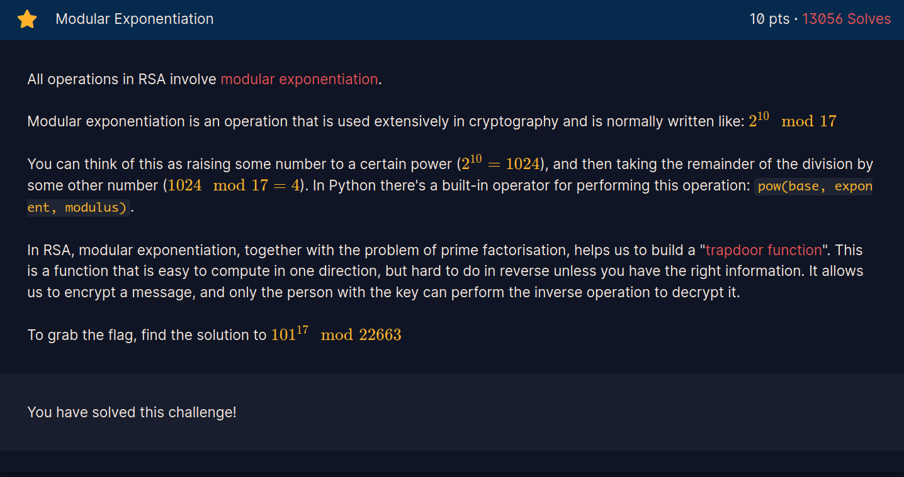
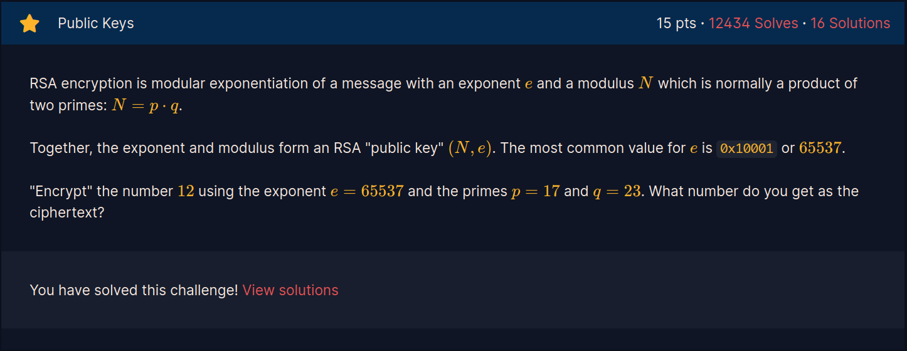
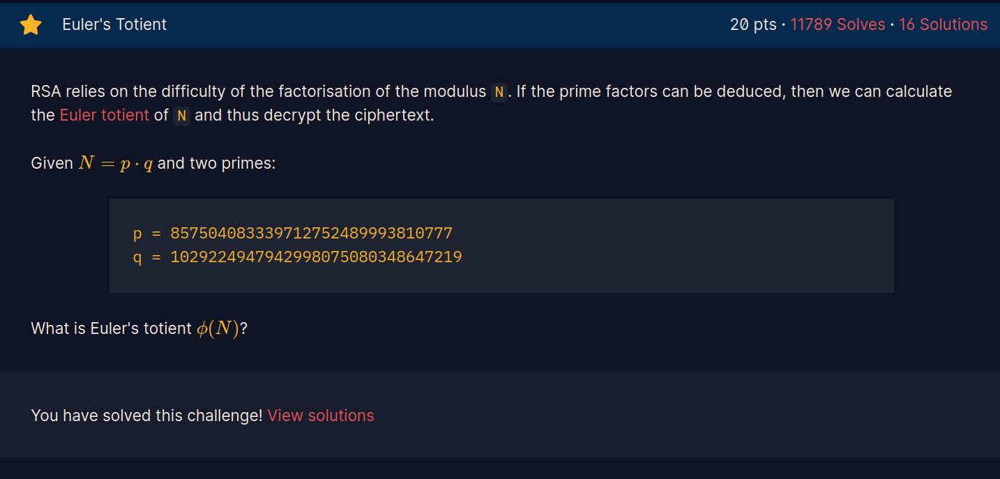
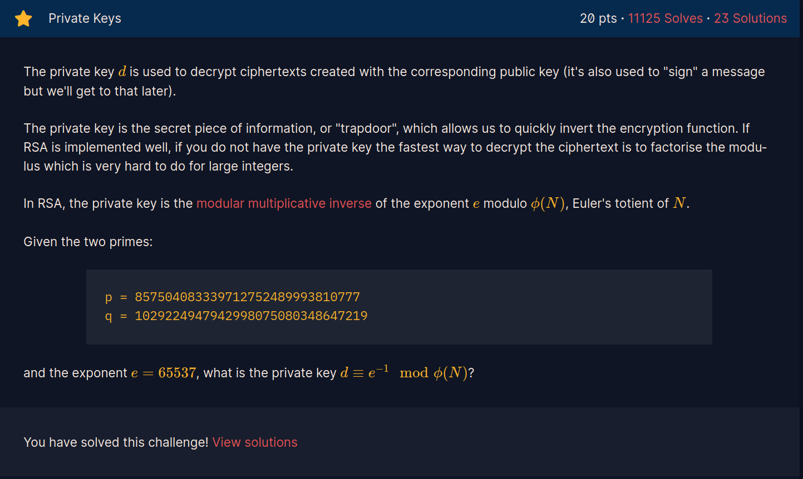
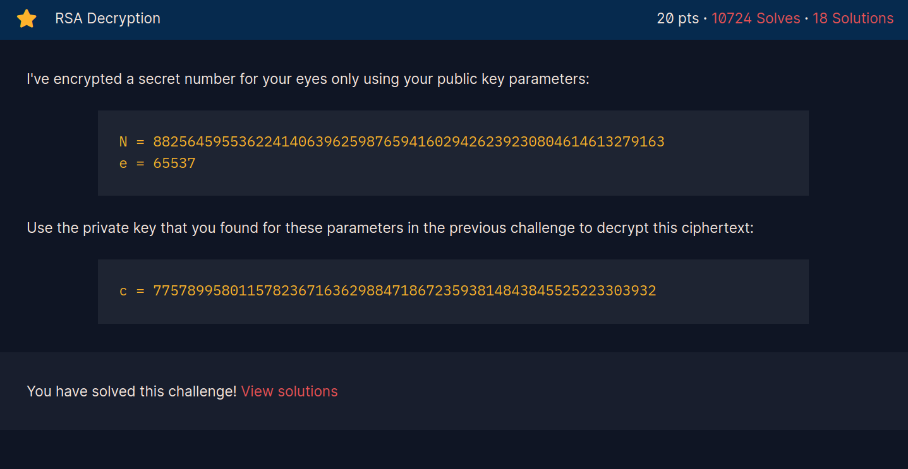
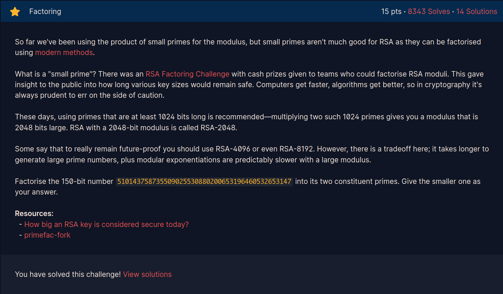
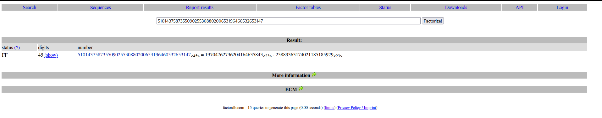

# PUBLIC-KEY CRYPTOGRAPHY
--- 

## Modular Exponentiation

### DESCRIPTION



**find the solution of 101^17 mod 22663**.

### SOLUTION

This introductory challenge is an easy one, where the only requirement is to calculate the given operation. We can do that using the python *pow()* function as follows:

```bash
>>> pow(101, 17, 22663)
19906
```

## Public Keys

### DESCRIPTION




**"Encrypt" the number 12 using the exponent e=65537 and the primes p=17 and q=23, what number do you get as the ciphertext?**

### SOLUTION

In asymmetric cryptography, the plaintext is encrypted using a **public key** and sent to the node that holds the corresponding **private key** to decrypt the message. In RSA, public keys are a pair of real numbers composed by *pub_key = (e, n)*, where *n = p x q*. Once the public key has been generated, any message can be encrypted with the formula *y = x^e mod n* where *x* is a given plaintext. With that said, we can craft the following small script to encrypt a given number and solve the challenge:

```python
PUBLIC_KEY = [65537, 17 * 23]

def cipher(x):
    return pow(x, PUBLIC_KEY[0], PUBLIC_KEY[1])

x = int(input("plaintext: "))
print(cipher(x))
```

```bash
[0xncat@archlinux asymmetric_cryptography]$ python3 pub_keys.py 
plaintext: 12
301
```

## Euler's Totient

### DESCRIPTION



**Given N=pxq and the primes p=857504083339712752489993810777 and q=1029224947942998075080348647219, what is Eluer's totient?**

### SOLUTION

Messages in RSA are recoverable because of the euler's totient function. With that we ensure that raising a plaintext *x* to the e-th power modulo *n* will be recover by raising the result to the *d-th* power modulo *n*. To find Euler's totient function, we apply the formula *phi(n) = (p - 1) x (q - 1)*

```bash
>>> (857504083339712752489993810777 - 1) * (1029224947942998075080348647219 - 1)
882564595536224140639625987657529300394956519977044270821168
```

## Private Keys

### DESCRIPTION



**Given p=857504083339712752489993810777, q=1029224947942998075080348647219 and e=65537, find the private key**

### SOLUTION

The private key is a number *d x e*, (where *d* is the **private exponent**) such that *d x e EQUIVALENT TO 1 mod phi(n)*, therefore, *d = e^-1 mod phi(n)* (notice how it all relies on making impossible to get the prime factors of *phi(n)*). Applying the previous operation will solve the challenge:

```bash
>>> pow(65537, -1, (857504083339712752489993810777 - 1) * (1029224947942998075080348647219 - 1))
121832886702415731577073962957377780195510499965398469843281
```

## Rsa Decryption

### DESCRIPTION



**Given N=882564595536224140639625987659416029426239230804614613279163, e=65537 and the private key from the previous challenge, decrypt c=77578995801157823671636298847186723593814843845525223303932**

### SOLUTION

To get the plaintext, we will need to apply the following formula using the private exponent: *x = y^d mod n*. We can use again the python *pow()* function for that:

```bash
>>> pow(77578995801157823671636298847186723593814843845525223303932, 121832886702415731577073962957377780195510499965398469843281,\
 882564595536224140639625987659416029426239230804614613279163)
13371337
```

## RSA Signatures

### DESCRIPTION


**Sign the flag crypto{Immut4ble_m3ssag1ng} using your private key and the sha256 function**

Where the private key is:

```bash
N = 15216583654836731327639981224133918855895948374072384050848479908982286890731769486609085918857664046075375253168955058743185664390273058074450390236774324903305663479046566232967297765731625328029814055635316002591227570271271445226094919864475407884459980489638001092788574811554149774028950310695112688723853763743238753349782508121985338746755237819373178699343135091783992299561827389745132880022259873387524273298850340648779897909381979714026837172003953221052431217940632552930880000919436507245150726543040714721553361063311954285289857582079880295199632757829525723874753306371990452491305564061051059885803
d = 11175901210643014262548222473449533091378848269490518850474399681690547281665059317155831692300453197335735728459259392366823302405685389586883670043744683993709123180805154631088513521456979317628012721881537154107239389466063136007337120599915456659758559300673444689263854921332185562706707573660658164991098457874495054854491474065039621922972671588299315846306069845169959451250821044417886630346229021305410340100401530146135418806544340908355106582089082980533651095594192031411679866134256418292249592135441145384466261279428795408721990564658703903787956958168449841491667690491585550160457893350536334242689
```

### SOLUTION

A message *m* is signed trough the following process:

- *m* is encrypted using *c = m^e mod n* with the shared public key
- a hash function is applied to *m*, *Hash(m) = HASH*
- the *HASH* is then signed using the sender's private key *Signature = HASH^d mod n*

The following code applies the above process and successfully solves the challenge:

```python
from Crypto.Util.number import bytes_to_long
from hashlib import sha256

N = 15216583654836731327639981224133918855895948374072384050848479908982286890731769486609085918857664046075375253168955058743185664390273058074450390236774324903305663479046566232967297765731625328029814055635316002591227570271271445226094919864475407884459980489638001092788574811554149774028950310695112688723853763743238753349782508121985338746755237819373178699343135091783992299561827389745132880022259873387524273298850340648779897909381979714026837172003953221052431217940632552930880000919436507245150726543040714721553361063311954285289857582079880295199632757829525723874753306371990452491305564061051059885803
d = 11175901210643014262548222473449533091378848269490518850474399681690547281665059317155831692300453197335735728459259392366823302405685389586883670043744683993709123180805154631088513521456979317628012721881537154107239389466063136007337120599915456659758559300673444689263854921332185562706707573660658164991098457874495054854491474065039621922972671588299315846306069845169959451250821044417886630346229021305410340100401530146135418806544340908355106582089082980533651095594192031411679866134256418292249592135441145384466261279428795408721990564658703903787956958168449841491667690491585550160457893350536334242689
m = "crypto{Immut4ble_m3ssag1ng}"

def sign_message():
    m_hash = bytes_to_long(sha256(m.encode()).digest())
    signature = pow(m_hash, d, N)

    return signature

print(sign_message())
```

## Factoring

### DESCRIPTION



**Factorise the number 510143758735509025530880200653196460532653147 and give the smalles prime factor as the answer**

### SOLUTION

This refers to factoring an RSA modulus to get the two primes, we can use *http://factordb.com/index.php?query=510143758735509025530880200653196460532653147* and get the following results:



## Monoprime

### DESCRIPTION


**Why is everyone so obsessed with multiplying two primes for RSA. Why not just use one?**

### SOLUTION

The given file contains the public key and the ciphertext. If RSA is monoprime, that means *n = p*, thus *phi(n) = n - 1*, therefore, *d = e^-1 mod n*, that means the private exponent is directly computable given that *n* is not composed by the product of two numbers, therefore, we can solve this challenge as follows:

```python
from Crypto.Util.number import bytes_to_long, long_to_bytes

n = 171731371218065444125482536302245915415603318380280392385291836472299752747934607246477508507827284075763910264995326010251268493630501989810855418416643352631102434317900028697993224868629935657273062472544675693365930943308086634291936846505861203914449338007760990051788980485462592823446469606824421932591                                                                  
e = 65537
ct = 161367550346730604451454756189028938964941280347662098798775466019463375610700074840105776873791605070092554650190486030367121011578171525759600774739890458414593857709994072516290998135846956596662071379067305011746842247628316996977338024343628757374524136260758515864509435302781735938531030576289086798942  

def decrypt():
    d = pow(e, -1, n - 1)
    
    return pow(ct, d, n)

print(long_to_bytes(decrypt()))
```

```bash
(crypto) [0xncat@archlinux asymmetric_cryptography]$ python3 monoprime.py 
b'crypto{0n3_pr1m3_41n7_pr1m3_l0l}'
```

## Manyprime

### DESCRIPTION


**Using one prime factor was definitely a bad idea so I'll try using over 30 instead**

### SOLUTION

The solution is the same as above, the only difference will be the amount of primes to consider when calculating *phi*:

```python
from Crypto.Util.number import bytes_to_long, long_to_bytes

n = 580642391898843192929563856870897799650883152718761762932292482252152591279871421569162037190419036435041797739880389529593674485555792234900969402019055601781662044515999210032698275981631376651117318677368742867687180140048715627160641771118040372573575479330830092989800730105573700557717146251860588802509310534792310748898504394966263819959963273509119791037525504422606634640173277598774814099540555569257179715908642917355365791447508751401889724095964924513196281345665480688029639999472649549163147599540142367575413885729653166517595719991872223011969856259344396899748662101941230745601719730556631637
e = 65537
ct = 320721490534624434149993723527322977960556510750628354856260732098109692581338409999983376131354918370047625150454728718467998870322344980985635149656977787964380651868131740312053755501594999166365821315043312308622388016666802478485476059625888033017198083472976011719998333985531756978678758897472845358167730221506573817798467100023754709109274265835201757369829744113233607359526441007577850111228850004361838028842815813724076511058179239339760639518034583306154826603816927757236549096339501503316601078891287408682099750164720032975016814187899399273719181407940397071512493967454225665490162619270814464
factorize = [ 9282105380008121879,   9303850685953812323,   9389357739583927789,   10336650220878499841,   10638241655447339831,   11282698189561966721,   11328768673634243077,   11403460639036243901,   11473665579512371723,   11492065299277279799,   11530534813954192171,   11665347949879312361,   12132158321859677597,   12834461276877415051,   12955403765595949597,   12973972336777979701,   13099895578757581201,   13572286589428162097,   14100640260554622013,   14178869592193599187,   14278240802299816541,   14523070016044624039,   14963354250199553339,   15364597561881860737,   15669758663523555763,   15824122791679574573,   15998365463074268941,   16656402470578844539,   16898740504023346457,   17138336856793050757,   17174065872156629921,   17281246625998849649,]

def decrypt():
    phi = 1

    for i in range(len(factorize)):
        phi *= factorize[i] - 1

    d = pow(e, -1, phi)

    return pow(ct, d, n)

print(long_to_bytes(decrypt()))
```

```bash
(crypto) [0xncat@archlinux asymmetric_cryptography]$ python3 manyprime.py 
b'crypto{700_m4ny_5m4ll_f4c70r5}'
```

## Salty

### DESCRIPTION


**Smallest exponent should be fastest, right?**

### SOLUTION

We are given the following script and result:

```python
#!/usr/bin/env python3

from Crypto.Util.number import getPrime, inverse, bytes_to_long, long_to_bytes

e = 1
d = -1

while d == -1:
    p = getPrime(512)
    q = getPrime(512)
    phi = (p - 1) * (q - 1)
    d = inverse(e, phi)

n = p * q

flag = b"XXXXXXXXXXXXXXXXXXXXXXX"
pt = bytes_to_long(flag)
ct = pow(pt, e, n)

print(f"n = {n}")
print(f"e = {e}")
print(f"ct = {ct}")

pt = pow(ct, d, n)
decrypted = long_to_bytes(pt)
assert decrypted == flag
```

```txt
n = 110581795715958566206600392161360212579669637391437097703685154237017351570464767725324182051199901920318211290404777259728923614917211291562555864753005179326101890427669819834642007924406862482343614488768256951616086287044725034412802176312273081322195866046098595306261781788276570920467840172004530873767                                                                  
e = 1
ct = 44981230718212183604274785925793145442655465025264554046028251311164494127485
```

The important part here is to understand that *e = 1*, which implies that the ciphertext is going to be *y = x mod n*, therefore, the plaintext will be *x = y mod n*:

```python
from Crypto.Util.number import long_to_bytes

n = 110581795715958566206600392161360212579669637391437097703685154237017351570464767725324182051199901920318211290404777259728923614917211291562555864753005179326101890427669819834642007924406862482343614488768256951616086287044725034412802176312273081322195866046098595306261781788276570920467840172004530873767                                                                  
e = 1
ct = 44981230718212183604274785925793145442655465025264554046028251311164494127485

print(long_to_bytes(pow(ct, e, n)));
```

```bash
(crypto) [0xncat@archlinux asymmetric_cryptography]$ python3 salty.py 
b'crypto{saltstack_fell_for_this!}'
```

# Modulus Inutilis

### DESCRIPTION


**My primes should be more than large enough now!**

### SOLUTION

A script and a result are given:

```python
#!/usr/bin/env python3

from Crypto.Util.number import getPrime, inverse, bytes_to_long, long_to_bytes

e = 3
d = -1

while d == -1:
    p = getPrime(1024)
    q = getPrime(1024)
    phi = (p - 1) * (q - 1)
    d = inverse(e, phi)

n = p * q

flag = b"XXXXXXXXXXXXXXXXXXXXXXX"
pt = bytes_to_long(flag)
ct = pow(pt, e, n)

print(f"n = {n}")
print(f"e = {e}")
print(f"ct = {ct}")

pt = pow(ct, d, n)
decrypted = long_to_bytes(pt)
assert decrypted == flag
```

```txt
n = 17258212916191948536348548470938004244269544560039009244721959293554822498047075403658429865201816363311805874117705688359853941515579440852166618074161313773416434156467811969628473425365608002907061241714688204565170146117869742910273064909154666642642308154422770994836108669814632309362483307560217924183202838588431342622551598499747369771295105890359290073146330677383341121242366368309126850094371525078749496850520075015636716490087482193603562501577348571256210991732071282478547626856068209192987351212490642903450263288650415552403935705444809043563866466823492258216747445926536608548665086042098252335883
e = 3
ct = 243251053617903760309941844835411292373350655973075480264001352919865180151222189820473358411037759381328642957324889519192337152355302808400638052620580409813222660643570085177957
```

Even if the implementation of RSA in this case is well designed, the result contains the ciphertext and the public parameters. Since we know that *ct = x^e mod n*, where *ct* is known, we can try to solve the equation for *x* as *x^e = ct mod n*. Notice that we only need to get the cubic root of *ct*, therefore, we can use the following script to solve the challenge:

```python
from Crypto.Util.number import long_to_bytes
from gmpy2 import iroot

n = 17258212916191948536348548470938004244269544560039009244721959293554822498047075403658429865201816363311805874117705688359853941515579440852166618074161313773416434156467811969628473425365608002907061241714688204565170146117869742910273064909154666642642308154422770994836108669814632309362483307560217924183202838588431342622551598499747369771295105890359290073146330677383341121242366368309126850094371525078749496850520075015636716490087482193603562501577348571256210991732071282478547626856068209192987351212490642903450263288650415552403935705444809043563866466823492258216747445926536608548665086042098252335883
e = 3
ct = 243251053617903760309941844835411292373350655973075480264001352919865180151222189820473358411037759381328642957324889519192337152355302808400638052620580409813222660643570085177957

print(long_to_bytes(int(iroot(ct, 3)[0])))
```

```bash
(crypto) [0xncat@archlinux asymmetric_cryptography]$ python3 modulus_inutilis.py 
b'crypto{N33d_m04R_p4dd1ng}'
```